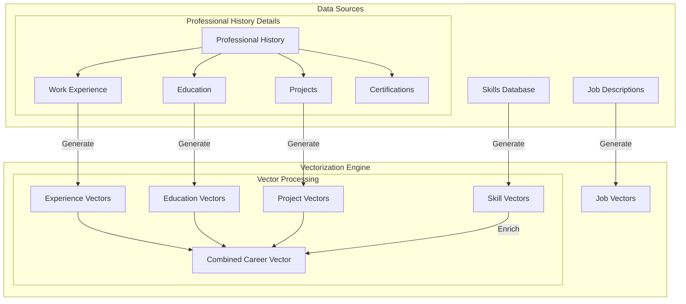

# Vector-Based Professional History System Requirements

## 1. System Architecture Overview

### Core Components
- Professional History Management
- Vector Generation and Storage
- Search and Match Operations
- AI-Powered Features
- Resume Generation Pipeline

### Data Flow


## 2. Data Structures

### Core Entities
```typescript
interface VectorizedEntity {
  content_embedding: number[] // 1536-dimensional vector
  last_embedded: string      // ISO date
  embedding_model: string    // e.g., "text-embedding-3-small"
}

interface ProfessionalHistory {
  id: string
  user_id: string
  last_updated: string
  is_complete: boolean
  combined_career_vector: number[] // Aggregated from all experiences
  metadata: {
    total_years_experience: number
    industry_focus: string[]
    career_level: string
  }
}

interface WorkExperience extends VectorizedEntity {
  id: string
  history_id: string
  company: string
  title: string
  start_date: string
  end_date?: string
  description: string
  achievements: Achievement[]
  technologies: string[]
  responsibility_vectors: number[][] // Multiple vectors for different aspects
  impact_metrics: ImpactMetric[]
}

interface Achievement {
  id: string
  description: string
  impact_score: number
  metrics: {
    value: number
    unit: string
    description: string
  }[]
  achievement_vector: number[] // For achievement-specific matching
}

interface ImpactMetric {
  category: 'revenue' | 'efficiency' | 'scale' | 'quality' | 'other'
  value: number
  unit: string
  description: string
  confidence_score: number
}

interface Skill extends VectorizedEntity {
  id: string
  name: string
  category: string
  proficiency: 1 | 2 | 3 | 4 | 5
  contexts: SkillContext[]
}

interface SkillContext {
  experience_id: string
  usage_description: string
  proficiency_at_time: number
  duration_months: number
}

interface Project extends VectorizedEntity {
  id: string
  history_id: string
  name: string
  description: string
  technologies: string[]
  url?: string
  metrics: ProjectMetric[]
  project_vector: number[]
  technical_complexity_score: number
}
```

## 3. Vector Operations

### Embedding Generation
```typescript
interface EmbeddingOperation {
  input_text: string
  model: string
  dimensions: number
  metadata: {
    source_type: 'experience' | 'skill' | 'project' | 'education'
    content_type: string
    timestamp: string
  }
}

interface VectorSearchParams {
  query_vector: number[]
  similarity_threshold: number
  limit: number
  filters: {
    content_type?: string[]
    date_range?: DateRange
    categories?: string[]
  }
}
```

## 4. Implementation Requirements

### Vector Storage (Supabase)
- Enable pgvector extension
- Create optimized indices for vector similarity search
- Implement efficient vector update strategies
- Support batch vector operations

```sql
-- Example vector storage setup
create extension if not exists vector;

alter table work_experience 
add column content_embedding vector(1536);

create index on work_experience 
using ivfflat (content_embedding vector_cosine_ops)
with (lists = 100);
```

### Vector Generation Service
- Queue-based embedding generation
- Rate limiting and batch processing
- Error handling and retry logic
- Versioning of embedding models

### Search Operations
- Semantic similarity search
- Role and skill matching
- Career path analysis
- Experience relevance scoring

## 5. AI Integration Features

### Content Enhancement
- Achievement impact scoring
- Skill extraction and categorization
- Experience summarization
- Technical complexity assessment

### Career Analysis
- Career progression patterns
- Skill gap identification
- Industry alignment
- Growth opportunity detection

### Resume Generation
- Context-aware content selection
- Achievement enhancement
- Skill relevance scoring
- Format optimization

## 6. Implementation Phases

### Phase 1: Core Vector Infrastructure
- [ ] Set up Supabase with pgvector
- [ ] Implement basic embedding generation
- [ ] Create core data structures
- [ ] Basic vector search operations

### Phase 2: Professional History Integration
- [ ] Work experience vectorization
- [ ] Skill vector generation
- [ ] Project embedding creation
- [ ] Combined career vector generation

### Phase 3: Search and Match Operations
- [ ] Semantic search implementation
- [ ] Role matching algorithms
- [ ] Career path analysis
- [ ] Experience relevance scoring

### Phase 4: AI Features
- [ ] Content enhancement
- [ ] Career analysis
- [ ] Resume tailoring
- [ ] Achievement scoring

## 7. Technical Considerations

### Performance
- Batch vector operations
- Caching strategy for frequent searches
- Incremental updates
- Query optimization

### Scalability
- Horizontal scaling of vector operations
- Efficient vector storage and retrieval
- Background processing for embedding generation
- Rate limiting and queue management

### Security
- Vector operation access control
- Data privacy in embeddings
- Secure API endpoints
- Audit logging

## Notes
- All vector operations should be asynchronous and queued
- Implement proper error handling and retry mechanisms
- Consider cost implications of embedding generation
- Monitor vector operation performance
- Implement proper versioning for embeddings
- Consider privacy implications of vector storage

